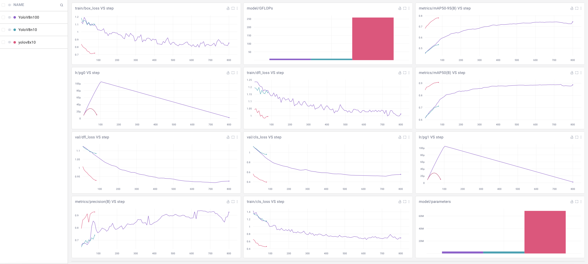

# Written report

<details>
<summary>Table of contents</summary>

- [Written report](#written-report)
  - [Context](#context)
  - [Target audience](#target-audience)
  - [Screen reader](#screen-reader)
    - [What is a screen reader?](#what-is-a-screen-reader)
    - [How does screen reader work?](#how-does-screen-reader-work)
    - [Why it is useful to improve them?](#why-it-is-useful-to-improve-them)
  - [Personas](#personas)
    - [Persona 1 Emma Johnson](#persona-1-emma-johnson)
    - [Persona 2 John Smith](#persona-2-john-smith)
  - [Laws and regulations](#laws-and-regulations)
  - [Requirements](#requirements)
  - [Functionalities](#functionalities)
  - [Must have](#must-have)
  - [Out of scope](#out-of-scope)
  - [Compatibility](#compatibility)
  - [Privacy](#privacy)
  - [Risks and assumptions](#risks-and-assumptions)
  - [Security](#security)
  - [Tools and Technologies](#tools-and-technologies)
    - [Programming Languages](#programming-languages)
      - [Frameworks and Libraries](#frameworks-and-libraries)
      - [Development Environment](#development-environment)
      - [Version Control](#version-control)
      - [Setup Development Environment](#setup-development-environment)
      - [Develop Machine Learning Model](#develop-machine-learning-model)
      - [Create Backend Server](#create-backend-server)
  - [Success criteria](#success-criteria)
  - [Technologies](#technologies)
    - [Browser Extension (Frontend)](#browser-extension-frontend)
    - [Backend Server](#backend-server)
    - [Machine Learning Model](#machine-learning-model)
  - [Setting up Python environment](#setting-up-python-environment)
  - [Training the machine learning model](#training-the-machine-learning-model)
  - [Tracking the performance of the model](#tracking-the-performance-of-the-model)
  - [Integrating the extension with the browser](#integrating-the-extension-with-the-browser)
  - [Why Ultralytics YOLOv8 is the best choice for this project](#why-ultralytics-yolov8-is-the-best-choice-for-this-project)
    - [Pertinence Against the Problem](#pertinence-against-the-problem)
  - [Comparison of YOLOv8 with Other Models](#comparison-of-yolov8-with-other-models)
    - [YOLOv8](#yolov8)
    - [VGG16 + LSTM](#vgg16--lstm)
    - [ResNet + Transformer](#resnet--transformer)
    - [EfficientNet + GRU](#efficientnet--gru)
  - [Detailed comparison table of machine learning models](#detailed-comparison-table-of-machine-learning-models)
  - [Why Flask is the best choice for the backend Server](#why-flask-is-the-best-choice-for-the-backend-server)
    - [Lightweight and Scalable](#lightweight-and-scalable)
  - [Why PyTorch is the best choice for the machine learning model](#why-pytorch-is-the-best-choice-for-the-machine-learning-model)
    - [Deep learning framework](#deep-learning-framework)
    - [Comparison of PyTorch with other machine learning frameworks](#comparison-of-pytorch-with-other-machine-learning-frameworks)
      - [PyTorch](#pytorch)
      - [TensorFlow](#tensorflow)
      - [Keras](#keras)
      - [OpenCV](#opencv)
    - [Detailed comparison table of machine learning frameworks](#detailed-comparison-table-of-machine-learning-frameworks)
  - [Comparison of Flask with other backend frameworks](#comparison-of-flask-with-other-backend-frameworks)
    - [Flask](#flask)
    - [Django](#django)
    - [Node.js (Express)](#nodejs-express)
    - [Ruby on rails](#ruby-on-rails)
  - [Detailed comparison table of backend frameworks](#detailed-comparison-table-of-backend-frameworks)
  - [Management](#management)
  - [Conclusion](#conclusion)
  - [Glossary](#glossary)
  - [References](#references)

</details>

## Context

Nowadays, the web is a very important part of our lives. It is used for many things, such as shopping, working, learning, and communicating. However, not everyone can use the web easily. People with disabilities, such as visual impairments, may have difficulty using the web. Screen readers are tools that help people with visual impairments use the web. They read the content of web pages out loud, so that people with visual impairments can hear it. However, screen readers are not perfect. They sometimes have trouble reading web pages correctly especially with images. In this project, I will try to improve screen readers by adding the correct alternative text to permit the screen reader to read the image . I will do this by training a machine learning model to recognize the content of an image. The model will then generate the correct alternative text for the image. This will help people with visual impairments.

## Target audience

In the world, there are between 40 and 45 million people who are blind. There are also between 285 and 300 million visually impaired people

## Screen reader

### What is a screen reader?

A screen reader is software that reads the content of a web page out loud. It does this by converting the text on the web page into speech. The screen reader can also read the content of images on the web page. However, it sometimes has trouble reading images correctly. This is because images do not have text associated with them. The screen reader cannot read the content of an image.

### How does screen reader work?

A screen reader works by converting the text on a web page into speech. It does this by using a text-to-speech engine.

### Why it is useful to improve them?

It is important to improve screen readers so that people with visual impairments can use the web more easily. By adding the correct alternative text to images, we can help screen readers read images correctly. This will make it easier for people with visual impairments to access the web.

## Personas

### Persona 1 Emma Johnson

- Age: 28
- Occupation: Content Creator
- Location: New York, USA
- Disability: Visually Impaired

**Background:**
Emma is a professional content creator who produces online tutorials and blogs about digital marketing. Despite her visual impairment, she is highly active on social media and relies heavily on technology for her work. Emma uses a screen reader to navigate the web and manage her online presence. She is proficient in using assistive technologies but often finds herself frustrated when encountering images without descriptive alternative text.

**Goals:**
To efficiently manage her website and social media content.
To access and understand web content without any barriers.
To create accessible content for her audience, ensuring inclusivity.

**Challenges:**
Struggles with images on websites that lack descriptive alternative text.
Experiences difficulties in accessing visual content, which hampers her ability to engage fully with digital resources.
Needs to ensure her own content is accessible, requiring reliable tools that support her in generating accurate alternative text.

**Technology Usage:**
Devices: MacBook Pro, iPhone
Assistive Tools: VoiceOver (screen reader)
Browsers: Safari, Google Chrome

**Needs:**
A reliable browser extension that can generate accurate alternative text for images.
Seamless integration with her current tools and workflow.
A tool that ensures her own content is accessible, promoting inclusivity among her audience.

### Persona 2 John Smith

- Age: 45
- Occupation: Customer Service Representative
- Location: London, UK
- Disability: Blind

**Background:**
John works as a customer service representative at a major telecom company. He has been blind since birth and has extensive experience using screen readers to perform his job. John enjoys staying informed about the latest technologies and uses the web for both professional and personal purposes. He often encounters challenges when images on web pages lack proper alternative text.

**Goals:**
To perform his job duties effectively without visual information barriers.
To stay informed about news and advancements in technology.
To independently navigate the web and access all types of content.

**Challenges:**
Finds it difficult to interpret web content when images are not described properly.
Encounters limitations in professional tasks that involve interacting with image-based information.
Needs to constantly rely on colleagues for assistance with inaccessible web content.
Technology Usage:
Devices: Windows PC, Android smartphone
Assistive Tools: JAWS (screen reader)
Browsers: Mozilla Firefox, Google Chrome

**Needs:**
An extension that can automatically generate descriptive alternative text for images.
Compatibility with JAWS to ensure seamless usage.
A tool that enhances his independence by providing accurate and contextually relevant image descriptions.

## Laws and regulations

The Web Content Accessibility Guidelines (WCAG) are a set of guidelines that help make the web more accessible to people with disabilities. The guidelines are divided into three levels: A, AA, and AAA. Level A is the minimum level of accessibility, while level AAA is the highest level of accessibility. The guidelines cover a wide range of topics, such as text alternatives for images, keyboard accessibility, and color contrast. By following the guidelines, web developers can make their websites more accessible to people with disabilities.
Moreover in France, the law for the digital republic (2016) requires that all public websites must be accessible to people with disabilities. This includes people with visual impairments. The law also requires that all public websites must be compatible with screen readers.

## Requirements

For this project to be successful, the project requires the following:

- A machine learning model to recognize the content of an image and generate the correct alternative text for the image.
- A server to host the machine learning model. It will be used to send the image to the model and receive the correct alternative text.
- Google Chrome at the beginning the extension will be tested on this browser

## Functionalities

The project is an extension that will have the following functionalities:

- The extension will take an image as input.
- The extension will use a machine learning model to recognize the content of the image.
- The extension will generate the correct alternative text for the image.

## Must have

- A machine learning model to recognize the content of an image
- A way to generate the correct alternative text for the image
- A way to test the extension

## Out of scope

In the future, the extension could be extended to include the following functionalities:

- Detecting the language of the image
- Generating alternative text in multiple languages
- Generating alternative text for videos
- Deploying the extension to the Chrome Web Store

## Compatibility

The extension will be compatible with the following browsers:

- Google Chrome
- Mozilla Firefox
- Microsoft Edge
- Apple Safari

I chose these browsers because they are the most popular browsers in the world. By making the extension compatible with these browsers, we can reach the largest number of users.

The extension will be compatible with the following screen readers:

- JAWS
- NVDA
- VoiceOver

I chose these screen readers because they are the most used screen readers by people with visual impairments. By making the extension compatible with these screen readers, we can reach the largest number of users.

## Privacy

The extension will not collect any personal information from the user. The extension will only use the image that the user provides as input. The image will not be stored on the server. The extension will generate the correct alternative text for the image and display it to the user.

## Risks and assumptions

| Risk | Assumption|
|------|-----------|
|The machine learning model may not be able to recognize the content of an image|Take in the future an other model|
|The server may not be able to handle the number of requests|Use a cloud service to host the server that will be for the next version of the project|
|The extension may not be compatible with all browsers and screen readers|Test the extension with a wide range of browsers and screen readers|
|The extension may not be able to generate the correct alternative text for an image|Test the extension with a wide range of images|

## Security

The security for extension is very important. The extension will not collect any personal information from the user. The extension will only use the image that the user provides as input. The image will not be stored on the server. The extension will generate the correct alternative text for the image and display it to the user.

## Tools and Technologies

### Programming Languages

- Python: For developing and training the machine learning model.
- JavaScript: For developing the browser extension.
- HTML/CSS: For creating the user interface of the extension.

#### Frameworks and Libraries

- PyTorch: For building and training the machine learning model.
- Flask: For setting up the server to host the machine learning model.

#### Development Environment

- IDE/Code Editors: Visual Studio Code, PyCharm, or any preferred IDE.
- Virtual Environment: For managing Python dependencies.

#### Version Control

- Git: For version control.
- GitHub For repository hosting.

#### Setup Development Environment

- Install Python
- Setup a virtual environment for Python dependencies.
- Initialize a Git repository for version control.

#### Develop Machine Learning Model

- Collect and preprocess image datasets.
- Train the machine learning model using PyTorch.
- Save the trained model for deployment.

#### Create Backend Server

- Set up a Flask server.
- Load the trained machine learning model.
- Create API endpoints to handle image uploads and return generated alternative text.

## Success criteria

If the extension can generate the correct alternative text for an image, then the project will be considered a success.

It is important to test the extension with a wide range of images to ensure that it can generate the correct alternative text for all types of images.

## Technologies

The following technologies are intended to be used in the project

**Programming Languages:** Python is to be used in the development and training of the machine learning model. For the browser extension, JavaScript for frontend, HTML/CSS. Frameworks: PyTorch and Ultralytics YOLOv8 for the ML part. Flask for the server backend.

**Tools:**

- IDEs: Visual Studio Code
- Version Control: Git and GitHub
- Virtual Environment: Virtualenv for managing Python dependencies
- Software Architecture: The software architecture of this project follows a modular and scalable design, consisting of the following components:

### Browser Extension (Frontend)

**Responsibilities:**

- Capture images from web pages.
- Send images to the backend server for processing.
- Display generated alternative text to the user.

**Technologies:**

- JavaScript for the core functionality.
- HTML/CSS for the user interface.

### Backend Server

**Responsibilities:**

- Host the machine learning model.
- Receive image data from the browser extension.
- Process images using the machine learning model to generate alt text.
- Send the generated alt text back to the browser extension.

**Technologies:**

- Flask for setting up a lightweight server.
- PyTorch and Ultralytics YOLOv8 for integrating and serving the machine learning model.

### Machine Learning Model

**Responsibilities:**

- Recognize the content of images.
- Generate descriptive alt text.

**Technologies:**

- PyTorch for the underlying deep learning framework.
- Ultralytics YOLOv8 for object detection and feature extraction.

## Setting up Python environment

Create a virtual environment using virtualenv to ensure a clean and isolated environment for the project. Run the following command in the project directory:

1. Create a virtual environment:

    ```bash
    virtualenv venv
    ```

2. Activate the virtual environment:

    ```bash
    source venv/bin/activate
    ```

3. Install the required packages:

    ```bash
    pip install flask torch torchvision ultralytics
    ```

4. Install the Comet_ml package for tracking and optimizing the model:

    ```bash
    pip install comet_ml
    ```

    This package is optional but recommended for better tracking and optimizing of the model.

## Training the machine learning model

To train the machine learning model using PyTorch and Ultralytics YOLOv8
We will use the COCO dataset for training the model. Especially the COCO128 dataset for faster training.
For that we will use the following command:

```python
model.train(data="coco128.yaml", epochs=100)  # train the model for 100 epochs
```

This command will start the training process using the COCO128 dataset and train the model for 100 epochs.
It will generate the dataset automatically.

## Tracking the performance of the model

To track the performance of the model, we can use the Comet_ml package. This package allows us to log and visualize the training process, including metrics, hyperparameters, and model performance.
With Comet_ml, we can easily monitor the training progress with graphs and charts, making it easier to optimize the model.


## Integrating the extension with the browser

- Packaging the browser extension for different browsers (Chrome, Firefox, etc.).
- Ensuring compatibility with various screen readers (JAWS, NVDA, VoiceOver).

## Why Ultralytics YOLOv8 is the best choice for this project

### Pertinence Against the Problem

- The problem of generating descriptive alt text for images is essentially an image captioning task, which requires understanding and describing the content of an image in natural language.
  
- YOLOv8 is a state-of-the-art object detection system that can detect and classify multiple objects within an image, providing detailed information about the content. This makes it ideal for generating descriptive alt text for images.

- Feature Extraction and Caption Generation: YOLOv8 can detect and classify multiple objects within an image, providing detailed information about the content. These features can then be used to generate descriptive and contextually relevant alt text, ensuring that visually impaired users receive accurate descriptions of the visual content.

- This choice of algorithm leverages the strengths of YOLOv8 in real-time object detection to provide a robust solution for generating alt text, directly addressing the needs of visually impaired users who rely on screen readers.

## Comparison of YOLOv8 with Other Models

### YOLOv8

**Strengths:**

- Real-time Performance: YOLOv8 is designed for real-time object detection, providing quick and accurate detection of multiple objects in an image.
High Accuracy: It offers improved accuracy and speed compared to earlier YOLO versions.
- Versatility: Effective in detecting a wide variety of objects, making it useful for generating descriptive alt text in diverse contexts.

**Weaknesses:**

- Caption Generation: YOLOv8 focuses on object detection. Additional steps are needed to convert detected objects into descriptive sentences.
  
### VGG16 + LSTM

**Strengths:**

- Image Captioning: Combining VGG16 (a CNN) with LSTM (a type of RNN) is a classic approach for image captioning. VGG16 extracts features, and LSTM generates coherent captions.
- Proven Performance: This architecture has been widely used and validated for generating descriptive captions.

**Weaknesses:**

- Speed: Slower compared to YOLOv8 in terms of object detection due to the complexity of combining CNN and LSTM.
- Scalability: May not perform as well in real-time applications compared to YOLOv8.

### ResNet + Transformer

**Strengths:**

- High Accuracy: Known for excellent performance in generating high-quality captions.

**Weaknesses:**

- Complexity: More computationally intensive and requires more resources, which can impact real-time performance.
- Implementation Difficulty: More complex to implement and fine-tune compared to YOLOv8.

### EfficientNet + GRU

**Strengths:**

- Efficiency: EfficientNet is designed to be both accurate and efficient, providing good performance with lower computational cost.
- Caption Generation: GRUs (Gated Recurrent Units) are simpler and faster alternatives to LSTMs for sequence generation.

**Weaknesses:**

- Real-time Performance: While efficient, it might not match YOLOv8's real-time object detection capabilities.

## Detailed comparison table of machine learning models

| Feature | YOLOv8 | VGG16 + LSTM | ResNet + Transformer | EfficientNet + GRU |
| --- | --- | --- | --- | --- |
| Real-time Performance | Excellent | Moderate | Moderate | Good |
| Accuracy | High | High | Very High | High |
| Object Detection | Outstanding | Good (requires additional steps) | Good (requires additional steps) | Good (requires additional steps) |
| Caption Generation | Requires additional steps | Excellent | Excellent | Good |
| Implementation Complexity | Moderate | High | High | Moderate |
| Resource Efficiency | High | Moderate | Low | High |
| Scalability | Excellent | Moderate | Low | Good |

## Why Flask is the best choice for the backend Server

### Lightweight and Scalable

- Flask is a lightweight and flexible microframework that is well-suited for building RESTful APIs and web services. It provides a simple and efficient way to set up a server backend for processing image data and generating alt text.

- Flask's modular design allows for easy integration with other Python libraries and frameworks, making it an ideal choice for hosting the machine learning model and handling image processing tasks.

- Flask's scalability and extensibility make it a versatile tool for building robust and efficient server applications, ensuring that the backend server can handle a large volume of image requests and provide timely responses to the browser extension.

## Why PyTorch is the best choice for the machine learning model

### Deep learning framework

- PyTorch is a powerful deep learning framework that provides a flexible and efficient platform for building and training neural networks. It offers a wide range of tools and libraries for developing complex machine learning models, making it an ideal choice for training the image recognition model.

- PyTorch's dynamic computational graph and automatic differentiation capabilities simplify the process of building and optimizing deep learning models, allowing for rapid prototyping and experimentation with different architectures and hyperparameters.

### Comparison of PyTorch with other machine learning frameworks

#### PyTorch

**Strengths:**

- Dynamic Computational Graph: PyTorch uses a dynamic computational graph, making it flexible and easy to debug.
- Strong Community and Ecosystem: Extensive support and a large number of pre-trained models and libraries.
- Ease of Use: Intuitive design and syntax, similar to Python, making it accessible to researchers and developers.
- Integration with Python: Seamless integration with Python libraries and tools.
- Versatility: Suitable for both research and production environments.

**Weaknesses:**
Performance: Slightly less optimized for production deployment compared to TensorFlow.

#### TensorFlow

**Strengths:**

- Static Computational Graph: Optimized for performance and deployment in production environments.
- Wide Adoption: Extensive industry adoption and support.
- Versatile: Supports a wide range of machine learning tasks, including deep learning and traditional ML.
- TensorFlow Serving: Robust tools for deploying models in production.

**Weaknesses:**

- Steeper Learning Curve: More complex and less intuitive than PyTorch.
- Debugging: More difficult to debug due to static computational graphs.

#### Keras

**Strengths:**

- High-Level API: User-friendly and easy to use, ideal for quick prototyping.
- Integration with TensorFlow: As part of TensorFlow 2.x, it benefits from TensorFlow's performance optimizations.
- Modularity: Simple to build and experiment with different models.

**Weaknesses:**

- Less Control: Higher-level abstraction can limit fine-grained control over model architecture and training processes.
- Dependency on TensorFlow: Performance and capabilities are tied to TensorFlow.

#### OpenCV

**Strengths:**

- Computer Vision Focus: Specifically optimized for computer vision tasks with extensive image processing capabilities.
- Real-Time Performance: Excellent performance for real-time applications.
Comprehensive Library: A wide range of functions for image and video analysis.

**Weaknesses:**

- Limited Deep Learning Support: While it supports deep learning models, it is not as comprehensive as frameworks like PyTorch or TensorFlow.
- Less Suitable for Training: Better suited for deployment rather than training deep learning models.

### Detailed comparison table of machine learning frameworks

| Feature | PyTorch | TensorFlow | Keras | OpenCV |
| --- | --- | --- | --- | --- |
| Ease of Use | High | Moderate | Very High | Moderate |
| Flexibility | Very High | High | Moderate | Moderate |
| Debugging | Easy (Dynamic Graph) | Hard (Static Graph) | Easy | Moderate |
| Performance | High | Very High | High | Very High |
| Deployment | Good | Excellent | Good | Excellent |
| Community and Ecosystem | Very Strong | Very Strong | Strong | Strong |
| Real-Time Applications | Good | Good | Moderate | Excellent |
| Image Processing Capabilities | Moderate | Moderate | Moderate | Excellent |
| Deep Learning Focus | Strong | Strong | Strong | Moderate |
| Integration with Python Libraries | Excellent | Good | Good | Good |

## Comparison of Flask with other backend frameworks

### Flask

**Strengths:**

- Simplicity and Flexibility: Flask is a micro-framework that is lightweight and easy to use, making it ideal for small to medium-sized applications.
- Modularity: Allows developers to pick and choose the components they need, promoting flexibility.
- Documentation and Community: Well-documented with a strong community for support.
- Integration with Python: Seamless integration with Python libraries, which is beneficial for a machine learning project.
  
**Weaknesses:**

- Limited Built-in Features: Requires additional libraries and extensions for features that are built-in with other frameworks.
- Scalability: Not as inherently scalable as some other frameworks for very large applications.

### Django

**Strengths:**

- Batteries-Included: Comes with a lot of built-in features, including an ORM, authentication, and an admin panel, which can speed up development.
- Security: Strong emphasis on security features and practices.
Scalability: Better suited for larger applications with complex requirements.
- Documentation and Community: Extensive documentation and a large community.

**Weaknesses:**

- Monolithic: Can be overkill for smaller applications due to its monolithic nature.
- Learning Curve: Steeper learning curve compared to Flask.
- Flexibility: Less flexible than Flask due to its opinionated design.

### Node.js (Express)

**Strengths:**

- Performance: High performance due to its non-blocking, event-driven architecture.
- JavaScript Everywhere: Allows using JavaScript for both frontend and backend, promoting a consistent development environment.
- Asynchronous Processing: Naturally suited for handling multiple concurrent connections, making it ideal for real-time applications.
- Large Ecosystem: Extensive ecosystem with a wide range of packages available through npm.

**Weaknesses:**

- Callback Hell: Can lead to complex and hard-to-maintain code if not managed properly (though modern practices like Promises and async/await help mitigate this).
- Single-Threaded: Despite its asynchronous nature, Node.js runs on a single thread, which can be a bottleneck for CPU-intensive tasks.
- Scalability: Can be challenging to scale for very high-traffic applications.

### Ruby on rails

**Strengths:**

- Convention over Configuration: Emphasizes conventions to streamline development, leading to faster development cycles.
- Built-in Features: Comes with many built-in features, such as ORM, migrations, and scaffolding.
- Community and Resources: Strong community and a wealth of resources and libraries (gems).
- Productivity: High developer productivity due to the framework's emphasis on simplicity and convention.

**Weaknesses:**

- Performance: Generally slower than Node.js and even Flask in some scenarios.
- Scalability: Can be more challenging to scale for very high-traffic applications.

## Detailed comparison table of backend frameworks

| Feature | Flask | Django | Node.js (Express) | Ruby on Rails |
| --- | --- | --- | --- | --- |
| Ease of Use | High | Moderate | High | High |
| Flexibility | Very High | Moderate | High | Moderate |
| Learning Curve | Gentle | Steep | Gentle | Moderate |
| Built-in Features | Minimal | Extensive | Minimal | Extensive |
| Performance | Good | Moderate | Excellent | Moderate |
| Scalability | Moderate | High | High | Moderate |
| Community and Ecosystem | Strong | Very Strong | Very Strong | Strong |
| Integration with Machine Learning | Excellent | Excellent | Good | Good |
| Security | Moderate | Very High | Moderate | High |
| Development Speed | Fast | Moderate | Fast | Fast |

## Management

Like I was alone on this project. I was responsible for all aspects of the project, so I put in place different milestones to ensure the project was on track.

1. **Research and Planning:** This phase involved researching the problem, understanding the target audience, and planning the project scope and requirements.
This phase will be completed in approximately 1 year and 2 month. Because it is a complex project with a complex subject to understand.

2. **Development:** This phase involved developing the machine learning model, setting up the backend server, and creating the browser extension.
This phase will be completed in approximately 6 month.

3. **Testing:** This phase involved testing the extension with different browsers and screen readers, as well as testing the machine learning model with a wide range of images. This phase will be completed in approximately 4 month. To test the extension with different browsers and screen readers, as well as test the machine learning model with a wide range of images.

## Conclusion

This project intends to significantly enhance web accessibility for visually impaired users by creating a tool that generates accurate alternative text for images. Using machine learning, this project shall try to bridge the gap between visual content and people who depend on screen readers to make the web more accessible to all.

## Glossary

**Alternative Text (Alt Text)**
A short, written description of an image that is read aloud by screen readers to describe the content of the image to users who cannot see it.

**Assistive Technology**
Devices or software that help people with disabilities perform functions that might otherwise be difficult or impossible.

**Cloud Service**
A service that is provided to users over the internet from a cloud computing provider's servers, rather than being hosted on a local server.

**Digital Accessibility**
The practice of making digital content and services accessible to all users, including those with disabilities.

**IDE (Integrated Development Environment)**
A software application that provides comprehensive facilities to computer programmers for software development. Examples include Visual Studio Code and PyCharm.

**Machine Learning Model**
A type of artificial intelligence that allows software applications to become more accurate at predicting outcomes without being explicitly programmed to do so. It uses algorithms to identify patterns in data.

**NVDA (NonVisual Desktop Access)**
A free, open-source screen reader for Microsoft Windows. It allows blind and vision-impaired people to use a computer by reading the text on the screen in a computerized voice.

**PyTorch**
An open-source machine learning library based on the Torch library, used for applications such as computer vision and natural language processing.

**Virtual Environment**
A tool to keep dependencies required by different projects in separate places, by creating isolated environments for each of them. This is helpful in managing project-specific dependencies and avoiding conflicts.

**VoiceOver**
A screen reader built into Apple Inc.'s macOS, iOS, watchOS, and tvOS operating systems. It enables visually impaired users to use a computer or mobile device.

**Dependencies**
Software libraries or packages that a program needs to function correctly. They are usually installed using package managers like pip for Python.

## References

- [JAWS (Job Access With Speech)](https://www.freedomscientific.com/products/software/jaws/)
- [NVDA (NonVisual Desktop Access)](https://www.nvaccess.org/)
- [VoiceOver](https://www.apple.com/accessibility/mac/vision/)
- [Google Chrome](https://www.google.com/chrome/)
- [PyTorch Documentation](https://pytorch.org/docs/stable/index.html)
- [Flask Documentation](https://flask.palletsprojects.com/en/2.0.x/)
- [Comet_ml](https://www.comet.ml/)
- [COCO Dataset](https://cocodataset.org/)
- [Ultralytics YOLOv8](https://docs.ultralytics.com/modes/)
- [LSTM (Long Short-Term Memory)](https://en.wikipedia.org/wiki/Long_short-term_memory)
- [GRU (Gated Recurrent Unit)](https://en.wikipedia.org/wiki/Gated_recurrent_unit)
- [VGG16 Documentation](https://neurohive.io/en/popular-networks/vgg16/)
- [ResNet Documentation](https://neurohive.io/en/popular-networks/resnet/)
- [EfficientNet Documentation](https://neurohive.io/en/popular-networks/efficientnet/)
- [OpenCV Documentation](https://opencv.org/)
- [Node.js Documentation](https://nodejs.org/en/)
- [Ruby on Rails Documentation](https://rubyonrails.org/)
- [Express Documentation](https://expressjs.com/)
- [Django Documentation](https://www.djangoproject.com/)
- [TensorFlow Documentation](https://www.tensorflow.org/)
- [Keras Documentation](https://keras.io/)
